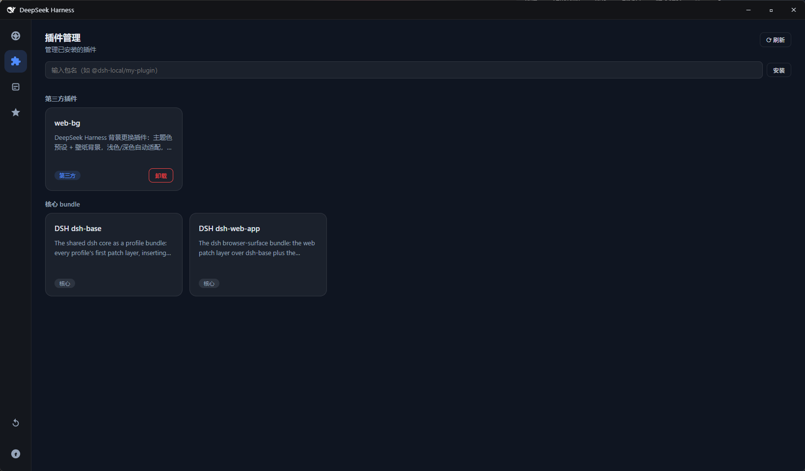
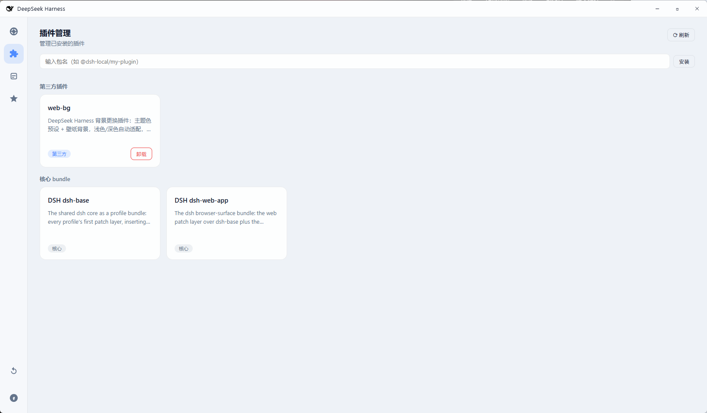
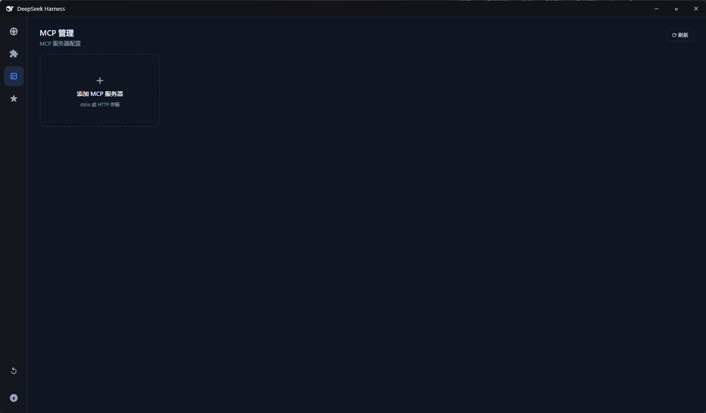
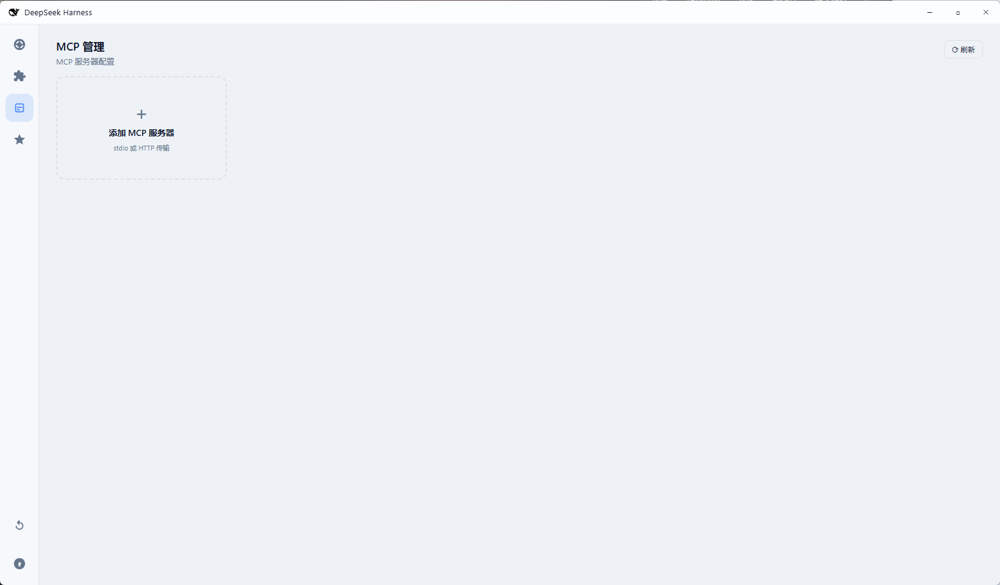
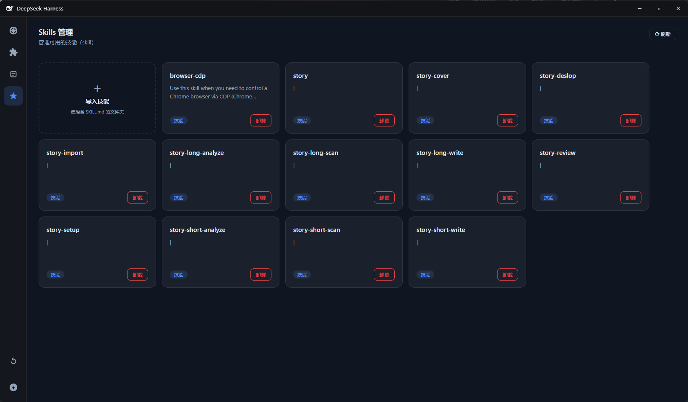
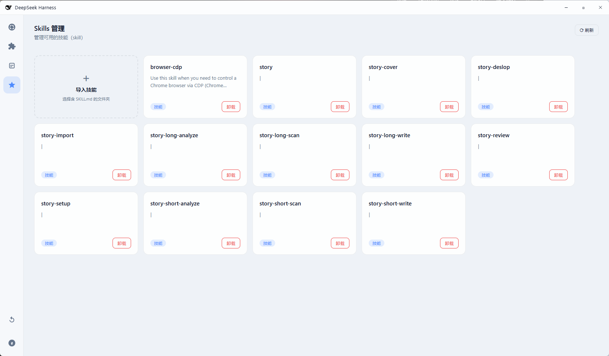

# DeepSeek Harness 桌面客户端（壳）

Electron 套壳封装 `dsh web`，提供 Codex 式的独立桌面窗口体验：自绘标题栏、左侧导航栏、托盘常驻、单实例、进程生命周期管理，一键打包 Windows NSIS 安装程序。

> ⚠️ **平台支持**：目前仅支持 **Windows**（macOS / Linux 支持后续规划中）。

## ✨ 壳的功能

- **加载页面**：启动动画（三步环境检查：Node.js 检查 → dsh 检查 → 服务启动），每步状态实时打勾/打叉，跟随主题
- **内置 Node.js**：安装包自带 Node（约 25MB），系统没装 Node 也能直接运行；winget 仅作兜底
- **环境自动修复**：缺 dsh 自动通过 npx 安装，零命令行
- **自定义标题栏**：鲸鱼图标 + 标题 + 可拖动窗口 + 毛玻璃 + 按钮随主题变色
- **左侧导航栏**：Harness / 插件 / MCP / Skills 页面切换，悬停提示跟随鼠标位置
- **插件管理**：卡片化展示第三方插件，支持安装（npm registry）/ 卸载，成功靠卡片动画反馈
- **MCP 管理**：卡片化管理 MCP 服务器（stdio / streamable-http），支持添加 / 编辑 / 删除，保存后自动重启服务生效
- **Skills 管理**：扫描 DSH 标准技能位置（`~/.agents/skills` 等），支持文件夹导入安装 / 卸载，带过渡动画与高亮反馈
- **壳窗口背景跟随**：导航栏/标题栏毛玻璃实时透出 DSH 主题色或壁纸（事件驱动，零轮询，与具体插件解耦）
- **主题跟随**：加载页面、标题栏、导航栏全部跟随 DSH 主题（浅色 / 深色 / 跟随系统）
- **关闭选择框**：点关闭时弹出勾选式选择（关闭窗口 / 关闭服务 多选组合），支持最小化到托盘 / 仅退出 / 退出并停止服务
- **托盘常驻**：托盘菜单区分「停止服务并退出」/「退出」
- **端口复用**：检测到 dsh web 已在运行则直接复用，否则自动拉起，避免多实例
- **单实例**：重复打开应用会把已有窗口拉回前台

## 📸 界面预览

**加载页面**（启动动画，主题跟随）：

| 加载中 · 深色 | 加载中 · 浅色 |
|---|---|
|  |  |

**主界面**（独立窗口 + 自定义标题栏 + 左侧导航栏）：

| 深色主题 | 浅色主题 |
|---|---|
|  |  |

**插件管理页**（卡片化 + 安装/卸载）：

| 深色主题 | 浅色主题 |
|---|---|
|  |  |

**MCP 管理页**（卡片化 + 添加/编辑/删除）：

| 深色主题 | 浅色主题 |
|---|---|
|  |  |

**Skills 管理页**（技能卡片 + 导入入口）：

| 深色主题 | 浅色主题 |
|---|---|
|  |  |

## 🚀 开发运行

```bash
npm install            # 安装依赖（含 Electron 运行时）
npm start              # 启动桌面应用（自动拉起/复用 dsh web 并开窗口）
```

## 📦 打包安装程序

> ⚠️ **打包前先准备两个前置资源**（都不在 git 仓库里，体积大）：

**1. 内置 Node**：`vendor/node` 便携版（打进 `resources/node`）：

```bash
# 下载 Node 便携版（以 v26.7.0 为例，npmmirror 镜像）
curl -L -o node.zip https://npmmirror.com/mirrors/node/v26.7.0/node-v26.7.0-win-x64.zip
# 解压并重命名到 vendor/node（去掉版本号目录）
Expand-Archive node.zip -DestinationPath vendor-tmp
Move-Item vendor-tmp/node-v26.7.0-win-x64 vendor/node
```

**2. 内置 dsh bundle**：`build/dsh-bundle.tar`（DeepSeek Harness 本体 + 全部依赖，
首次启动自动解压到用户数据目录，零下载）。从 npx 缓存的完整安装生成：

```powershell
# 找到 npx 缓存的 dsh 安装目录（先跑一次 npx --yes @deepseek-ai/dsh --version 确保缓存存在）
# 假设缓存目录为 C:\Users\<你>\AppData\Local\npm-cache\_npx\<hash>
cd <缓存目录>
tar -cf E:\Workspace\dsh-desktop\build\dsh-bundle.tar node_modules
```

然后打包（自动同步版本号到内置 dsh 的版本）：

```bash
npm run pack           # 生成免安装目录（dist/win-unpacked/）
npm run dist           # 生成 NSIS 安装程序（dist/DeepSeek Harness Setup *.exe）
```

> 内置后安装包约 148MB，空白电脑首次启动解压约 20s 即用，**无需联网下载**。

## ⚙️ 环境变量

| 变量 | 作用 |
|---|---|
| `DSH_DESKTOP_URL` | 覆盖 GUI 地址（默认 `http://localhost:3080`） |
| `DSH_DESKTOP_HOLD_SPLASH` | 预览模式：加载页面完成后停留不进入主页面（调试用） |

## 🧠 设计说明

- **Node 优先级**：系统已装 Node → 优先使用；系统没装 → 使用应用内置 Node（`resources/node`）。
- **内置 dsh**：安装包内置 DeepSeek Harness 本体 + 全部依赖（`build/dsh-bundle.tar`），首次启动解压到用户数据目录即用，零下载；解压失败时明确报错（不再回退 npx 下载）。
- **端口复用**：启动时先探测 3080 并确认是 DSH 服务；已有实例则直接复用，否则后台拉起一个，避免多实例。
- **关闭行为**：点关闭弹出勾选式选择框——都不勾 = 最小化到托盘；仅勾窗口 = 退出客户端（服务保留）；仅勾服务 = 只停服务；都勾 = 退出并停止服务。
- **托盘常驻**：托盘菜单提供「停止服务并退出」（无条件结束 3080 服务）/「退出」（保留服务）。
- **壳窗口背景跟随**：在 Harness iframe 注入 MutationObserver，监听页面 `style` / `data-dsh-bg` / `colorScheme` 等属性变化，经 postMessage → IPC 立即同步——导航栏/标题栏保持默认中性半透明（浅色/深色各自定义），body 背景透出 DSH 主题色或壁纸，毛玻璃自然跟随；与具体插件解耦（只读 DSH 标准 CSS 变量）。
- **单实例**：重复打开应用会把已有窗口拉回前台。

## 📁 目录结构

```
dsh-desktop/
├── electron/
│   ├── main.js        # 主进程（窗口/托盘/生命周期/服务管理/IPC）
│   ├── preload.js     # 窗口控制桥接（标题栏按钮 + 管理页 IPC + 关闭选择）
│   ├── splash.html    # 加载页面（三步状态机，双主题）
│   ├── nav.html       # 壳页面（标题栏 + 左侧导航栏 + 内容 iframe + 关闭选择框）
│   └── manage.html    # 插件/MCP/Skills 管理页（卡片化 UI）
├── build/
│   ├── icon.png       # 应用图标 256x256（黑鲸）
│   ├── icon-blue.png  # exe 内嵌图标（蓝鲸，桌面快捷方式）
│   ├── tray.png       # 托盘图标 32x32
│   ├── favicon-official.svg  # 官方鲸鱼矢量图
│   └── favicon-blue.svg      # 蓝色鲸鱼矢量图
├── vendor/node/       # 内置 Node 便携版（git 忽略，打包前置条件）
├── screenshots/       # 界面截图（README 引用）
├── convert-icon.js    # 图标生成脚本
├── package.json       # 依赖与 electron-builder 配置
└── dist/              # 打包产物
```
