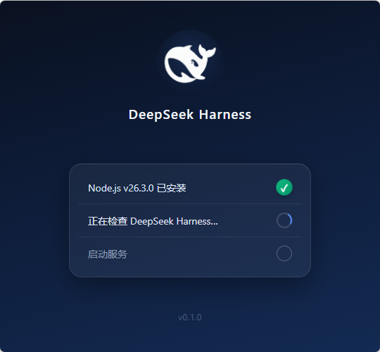
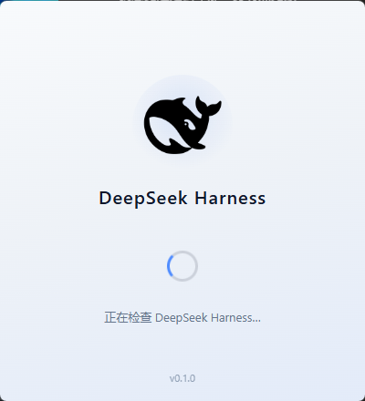
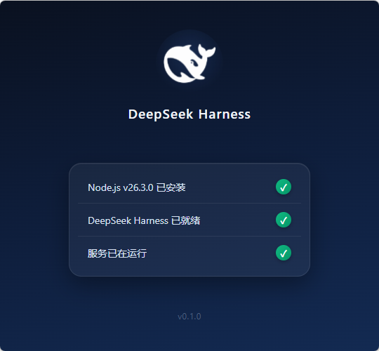
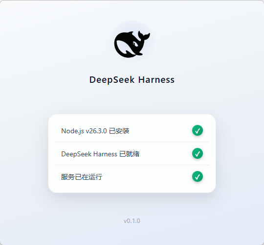
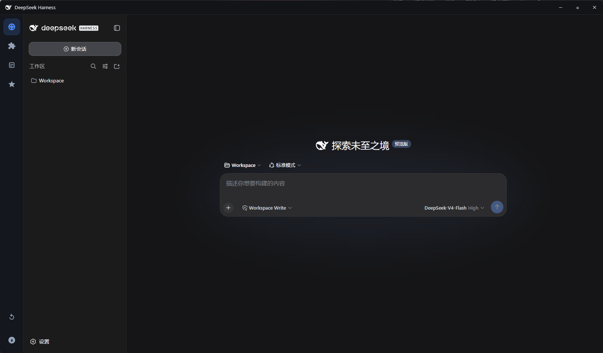
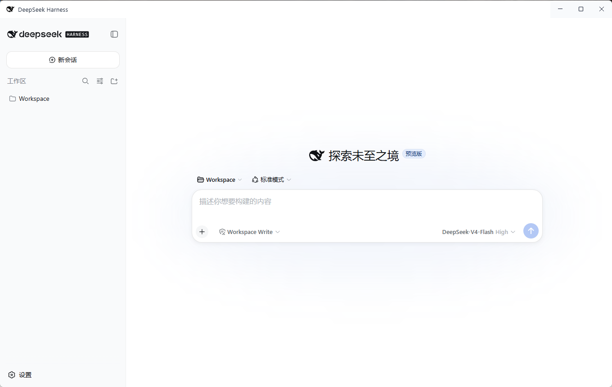

# DeepSeek Harness 桌面应用

Electron 套壳封装 `dsh web`，提供 Codex 式的独立桌面窗口体验（托盘常驻、单实例、进程生命周期管理）。

> ⚠️ **平台支持**：目前仅支持 **Windows**（macOS / Linux 支持后续规划中）。

## 界面预览

**启动画面**（三步环境检查动画：Node 检查 → dsh 检查 → 服务启动，主题跟随 DSH 设置）：

| 加载中 · 深色 | 加载中 · 浅色 |
|---|---|
|  |  |

| 完成 · 深色 | 完成 · 浅色 |
|---|---|
|  |  |

**主界面**（独立窗口 + 自定义标题栏）：

| 深色主题 | 浅色主题 |
|---|---|
|  |  |

## 功能特性

- **三步启动动画**：Node.js 检查 → DeepSeek Harness 检查 → 服务启动，每步状态实时打勾/打叉
- **环境自动修复**：缺 Node 自动通过 winget 安装（系统级）、缺 dsh 自动通过 npx 安装，零命令行
- **主题跟随**：启动画面、标题栏、窗口按钮颜色全部跟随 DSH 主题（浅色/深色/跟随系统）
- **自定义标题栏**：鲸鱼图标 + 标题 + 可拖动窗口 + 按钮随主题变色
- **托盘常驻**：关闭窗口最小化到托盘，任务后台继续运行
- **端口复用**：检测到 dsh web 已在运行则直接复用，否则自动拉起

## 开发运行

```bash
npm install            # 安装依赖（含 Electron 运行时）
npm start              # 启动桌面应用（自动拉起/复用 dsh web 并开窗口）
```

## 打包安装程序

```bash
npm run pack           # 生成免安装目录（dist/win-unpacked/）
npm run dist           # 生成 NSIS 安装程序（dist/DeepSeek Harness Setup *.exe）
```

## 环境变量

| 变量 | 作用 |
|---|---|
| `DSH_DESKTOP_URL` | 覆盖 GUI 地址（默认 `http://localhost:3080`） |
| `DSH_DESKTOP_DSH_CMD` | 指定 dsh 可执行文件路径（默认自动定位：PATH → npx 缓存） |

## 设计说明

- **端口复用**：启动时先探测 3080；已有 dsh web 在跑（如浏览器 GUI 已打开）则直接复用，否则后台拉起一个。
- **托盘常驻**：点关闭 = 最小化到托盘，任务后台继续；托盘菜单"退出"才结束进程并清理子进程。
- **单实例**：重复打开应用会把已有窗口拉回前台。

## 目录结构

```
dsh-desktop/
├── electron/
│   └── main.js        # 主进程（窗口/托盘/生命周期）
├── build/
│   ├── icon.png       # 应用图标 256x256
│   └── tray.png       # 托盘图标 32x32
├── package.json       # 依赖与 electron-builder 配置
└── dist/              # 打包产物
```
